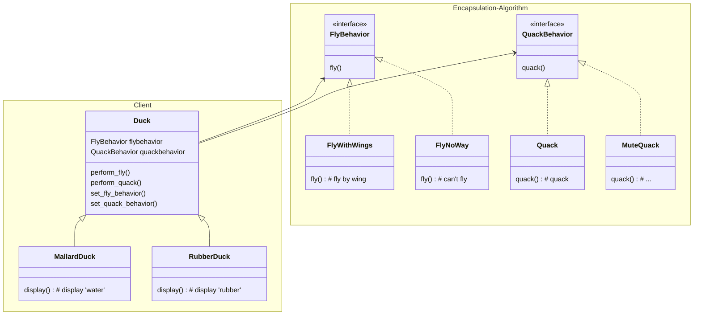

# Strategy Pattern
- 클라이언트로부터 알고리즘을 분리해서 독립적으로 변경할 수 있음
- 알고리즘을 정의하고, 캡슐화해서 각각의 알고리즘군을 수정해서 쓸 수 있게 해줌

## Example

```mermaid
classDiagram
    Duck <|-- MallardDuck
    Duck <|-- RubberDuck
    FlyBehavior <-- Duck
    <<interface>> FlyBehavior
    FlyBehavior <|.. FlyWithWings
    FlyBehavior <|.. FlyNoWay
    QuackBehavior <-- Duck
    <<interface>> QuackBehavior
    QuackBehavior <|.. Quack
    QuackBehavior <|.. MuteQuack
    namespace Client {
        class Duck{
            FlyBehavior flybehavior
            QuackBehavior quackbehavior
            perform_fly()
            perform_quack()
            set_fly_behavior()
            set_quack_behavior()
        }
        class MallardDuck{
            display()  # display 'water'
        }
        class RubberDuck{
            display() # display 'rubber'
        }
    }
    namespace Encapsulation-Algorithm{
        class FlyBehavior{
            fly()
        }
        class FlyWithWings{
            fly() # fly by wing
        }
        class FlyNoWay{
            fly() # can't fly
        }
        class QuackBehavior{
            quack()
        }
        class Quack{
            quack() # quack
        }
        class MuteQuack{
            quack() # ...
        }
    }
```